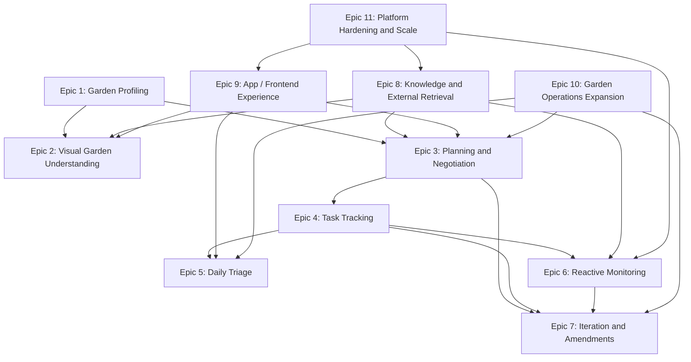

# Rhizome Long-Term Roadmap

**Status:** Canonical roadmap  
**Last updated:** 2026-06

---

## How to use this document

This is the primary roadmap for Rhizome going forward.

Use this document to answer:

- what has already been built
- which epics define the long-term product
- which features should exist by the end of each epic
- which epics depend on other epics
- which epics are blocked today
- which epics we can begin immediately

Older planning documents in this folder remain useful as:

- implementation records for completed phases
- subsystem specifications
- historical context for design decisions

But they should no longer be treated as the primary roadmap unless they
explicitly say so.

---

## Current status

Rhizome has completed five foundational phases plus a substantial API readiness pass:

1. **Phase 1:** Activity log foundation
2. **Phase 2:** Project planner foundation
3. **Phase 3:** Task tracker foundation
4. **Phase 4:** Operational triage, weather context, and reactive care
5. **Phase 5:** Structured interaction layer and CLI app simulation
6. **API readiness (2026-06):** 93 tools, task priority scoring, daily work list endpoint, action history, N+1 query fixes, schema hardening, 310 tests

What this means in practice:

- persistent garden, project, planning, task, triage, weather, incident, interaction, and activity state all exist
- the full loop **plan → task → triage → action → history** works in the CLI
- the backend API surface is complete — every planned Cambium endpoint has a backing tool
- **Cambium** (Go API gateway) is now in active development and will sit between Verdant and Rhizome
- future Rhizome work is focused on: Postgres migration, multi-tenancy, FastAPI internal interface for Cambium, and model provider abstraction

---

## Roadmap principles

The long-term roadmap should follow these principles:

1. **Build on the completed core**
   - avoid reopening solved foundations unless there is a clear product need

2. **Organize around epics, not vague themes**
   - every epic should describe a real product capability area

3. **Prefer end-to-end user loops**
   - features should improve the full loop:
     project -> plan -> tasks -> triage -> action -> history -> revision

4. **Make dependencies explicit**
   - visual, monitoring, and planning work should only be sequenced after we
     understand what they depend on and what they unlock

5. **Design for the app even when testing in the CLI**
   - the terminal is a simulation surface, not the final product

---

## Epic inventory

Below is the full current epic inventory for Rhizome.

Each epic includes:

- purpose
- features expected by the end of the epic
- current status
- dependency notes

### Epic 1: Garden Profiling and Spatial Garden Modeling

**Purpose**

Build a richer model of the physical garden: beds, containers, sunlight,
layout, constraints, and existing plants.

**Features expected by the end of the epic**

- guided garden profiling workflow
- structured bed and container intake
- sunlight-zone capture
- richer existing-plant inventory and assessment
- profile-update workflow when the garden changes
- ability to reason about physical layout, not just named objects

**Current status**

- partial

**What already exists**

- persistent garden profile, beds, containers, and plants
- weather location grounding on the profile

**Main dependencies**

- none as a prerequisite

**Epics helped by this one**

- Epic 2: Visual Garden Understanding
- Epic 3: Project Planning and Negotiation
- Epic 6: Reactive Monitoring and Alerting

---

### Epic 2: Visual Garden Understanding

**Purpose**

Let Rhizome use photos or video to identify plants, reason about plant health,
estimate conditions, and understand physical space.

**Features expected by the end of the epic**

- image upload / attachment support in the product flow
- plant identification from photos
- pest / disease candidate recognition with user confirmation
- visual assessment of plant condition
- garden layout / bed / container recognition from photos or video
- rough area and sunlight estimation support
- ability to turn visual observations into structured updates or follow-up
  proposals

**Current status**

- not started

**What already exists**

- incident and treatment-plan workflows
- care-state fields
- task tracker
- structured interactions

**Main dependencies**

- Epic 9: App-Facing Interaction and Frontend Experience is strongly preferred
  for a good user experience
- Epic 1: Garden Profiling and Spatial Garden Modeling helps define where visual
  observations should be written

**Blocked by**

- not hard-blocked, but partially constrained without Epic 9

**Epics helped by this one**

- Epic 1
- Epic 3
- Epic 6
- Epic 7

---

### Epic 3: Project Planning and Negotiation

**Purpose**

Upgrade the current planner foundation into a stronger negotiation and
constraint-resolution system.

**Features expected by the end of the epic**

- richer negotiation loop over proposals
- stronger hard-constraint checking
- explicit resource conflict resolution
- more explainable proposal comparison
- better revision requests and proposal editing
- stronger budget / time / effort tradeoff handling

**Current status**

- partial / strong foundation

**What already exists**

- `ProjectBrief`
- `ProjectProposal`
- `ProjectRevision`
- `ProjectExecutionSpec`
- proposal acceptance
- estimates and schedule preview

**Main dependencies**

- Epic 9: App-Facing Interaction and Frontend Experience is strongly preferred
  for proposal comparison UX
- Epic 1 improves planning inputs

**Blocked by**

- not blocked, but constrained without Epic 9

**Epics helped by this one**

- Epic 7: Iteration and Amendments
- Epic 4: Task Creation and Execution Tracking

---

### Epic 4: Task Creation and Execution Tracking

**Purpose**

Own persistent task generation, lifecycle management, dependencies, recurrence,
and task execution state.

**Features expected by the end of the epic**

- persistent generated task graphs
- recurring task rules and rolling materialization
- task dependencies and blocker logic
- task lifecycle updates
- event-relative follow-up scheduling
- regeneration and supersession behavior

**Current status**

- complete at the foundational level; enhanced with priority scoring

**What already exists**

- `Task` (with `priority` field: critical/high/normal/low)
- `TaskDependency`
- `TaskSeries`
- `TaskGenerationRun`
- generation, lifecycle, query, blocker, and daily priority tools
- `get_daily_priority_tasks` — deterministic scoring across urgency, type, priority, triage alignment, blocking count
- `cascade_defer_to_dependents` — deferred task pushes dependents' `earliest_start` forward
- status transition guards on complete/skip/defer (rejects done/superseded targets)

**Main dependencies**

- depends on Epic 3 for richer planning inputs

**Blocked by**

- not blocked for continued refinement

**Epics helped by this one**

- Epic 5
- Epic 6
- Epic 7

---

### Epic 5: Daily Triage and Operational Guidance

**Purpose**

Own the session-time experience of deciding what the user should do now.

**Features expected by the end of the epic**

- time/energy/focus-aware triage
- weather-aware task surfacing
- better agenda/blocker/backlog views
- recurring operational triage generation
- task-detail drilldowns and action launch points

**Current status**

- mostly complete for the first operational version

**What already exists**

- temporal grounding
- session context
- triage snapshots
- weather-aware triage
- structured triage cards

**Main dependencies**

- Epic 4
- Epic 6 for richer monitoring-aware triage
- Epic 9 for better UX

**Blocked by**

- background automation work is blocked by Epic 6 / platform automation support

**Epics helped by this one**

- Epic 9

---

### Epic 6: Reactive Monitoring and Alerting

**Purpose**

Move Rhizome from session-only awareness to proactive monitoring of weather,
pest conditions, and garden risk.

**Features expected by the end of the epic**

- scheduled weather refresh and alerting
- pest alert ingestion from external sources like iNaturalist
- vulnerability assessment against projects, tasks, and inventory
- alert-driven urgency upgrades
- alert-driven task recommendations
- approval-gated task adjustments
- optional triggering of plan amendments when monitoring results require it

**Current status**

- partial

**What already exists**

- weather snapshots
- weather-aware task-impact analysis
- approval-gated weather task changes
- user-reported incidents and treatment plans

**Main dependencies**

- Epic 4: Task Creation and Execution Tracking
- Epic 5: Daily Triage and Operational Guidance
- Epic 8: Knowledge and External Retrieval for richer external data

**Blocked by**

- background scheduling / automation infrastructure is still thin
- iNaturalist and related external integrations are not in place yet

**Epics helped by this one**

- Epic 5
- Epic 7

---

### Epic 7: Iteration and Amendments

**Purpose**

Let Rhizome revise active plans and task graphs in response to changing goals,
failures, weather, pests, or new ideas.

**Features expected by the end of the epic**

- change parsing
- impact assessment
- amendment generation
- approval-gated amendment flows
- plan and task updates that minimize disruption
- iteration history and traceability

**Current status**

- not started as a first-class workflow

**What already exists**

- revisions
- task supersession primitives
- structured review/approval interactions
- activity log

**Main dependencies**

- Epic 3: Project Planning and Negotiation
- Epic 4: Task Creation and Execution Tracking
- Epic 6: Reactive Monitoring and Alerting helps drive amendment triggers

**Blocked by**

- blocked by a stronger version of Epic 3

**Epics helped by this one**

- Epic 6

---

### Epic 8: Knowledge and External Retrieval

**Purpose**

Bring in structured plant knowledge, curated gardening knowledge, current web
context, and local external signals.

**Features expected by the end of the epic**

- plant-data integration (for example Perenual)
- local species / pest observation integration (for example iNaturalist)
- web search for current conditions, pricing, and novel situations
- curated gardening knowledge and retrieval
- explicit retrieval strategy across:
  - internal memory
  - structured APIs
  - web search
  - curated knowledge
  - vision results

**Current status**

- mostly not started

**What already exists**

- Open-Meteo usage in the weather workflow

**Main dependencies**

- none for initial slices

**Blocked by**

- not blocked, but full RAG likely wants later storage/platform work

**Epics helped by this one**

- Epic 2
- Epic 3
- Epic 6

---

### Epic 9: App-Facing Interaction and Frontend Experience

**Purpose**

Turn the current backend interaction contract into a real product surface in an
app, rather than only a CLI simulation.

**Features expected by the end of the epic**

- app UI for triage, proposals, treatment plans, weather changes, and tasks
- media/image upload flows
- better task list and task detail views
- better proposal comparison and approval UX
- better treatment-plan and weather-change review UX
- app-native use of pending/recent interaction records
- removal of remaining terminal-first assumptions in backend responses

**Current status**

- **Backend API surface complete.** All planned endpoints have backing tools.
  Cambium (Go API gateway) is in active development and will expose the surface
  to Verdant. Verdant (React frontend) not yet started.

**What already exists**

- `InteractionEnvelope`, `InteractionRecord`
- structured review and approval flows
- CLI simulation renderer
- 93 tools covering all planned `/api/v1` endpoints
- action history tools (`get_task_activity`, `list_project_activity`, etc.)
- `interaction_resolved` events recorded on every user decision
- **Cambium** (separate repo) — Go gateway handling JWT auth, bcrypt hashing, refresh token rotation, and `/api/v1` proxy

**What remains**

- Cambium Phase 2–4: auth endpoints, Rhizome proxy, full API surface
- Rhizome FastAPI internal interface (Cambium → Rhizome internal HTTP)
- Verdant frontend app
- Media upload (Epic 2 dependency)

**Main dependencies**

- none for the first app shell

**Blocked by**

- not blocked

**Epics helped by this one**

- Epic 2
- Epic 3
- Epic 5

---

### Epic 10: Garden Operations Expansion

**Purpose**

Expand Rhizome beyond planning/tasks into broader operational garden management.

**Features expected by the end of the epic**

- tool and resource inventory
- cost tracking
- produce / harvest tracking
- richer task metadata such as required materials/equipment
- broader care/treatment coverage

**Current status**

- not started

**Main dependencies**

- Epic 4 helps a lot
- Epic 8 may help with richer care/treatment recommendations

**Blocked by**

- not blocked

**Epics helped by this one**

- Epic 3
- Epic 5
- Epic 7

---

### Epic 11: Platform Hardening and Scale

**Purpose**

Strengthen the system for larger scope, more automation, more observability,
and longer-term robustness.

**Features expected by the end of the epic**

- richer observability / tracing / telemetry
- background workers and scheduled operations
- broader temporal / event engine
- stronger automation support
- possible Postgres migration
- clearer tenancy / permission model

**Current status**

- not started in a focused way

**Main dependencies**

- informed by real usage of the earlier epics

**Blocked by**

- should mostly be deferred until product pressure requires it

**Epics helped by this one**

- Epic 6
- Epic 8
- Epic 9

---

## Dependency graph

The high-level dependency graph looks like this:

Important dependency notes:

- Epic 2 is not strictly blocked by Epic 9, but Epic 9 makes it much more
  usable
- Epic 7 is the clearest example of a truly downstream epic: it depends on
  stronger planning and task infrastructure
- Epic 6 is partially blocked by missing external integrations and background
  operation infrastructure

---

## Blocked / unblocked epics

### Epics we can work on immediately

These epics are not blocked by missing foundational work:

1. **Epic 9: App-Facing Interaction and Frontend Experience**
2. **Epic 2: Visual Garden Understanding**
3. **Epic 6: Reactive Monitoring and Alerting**
4. **Epic 3: Project Planning and Negotiation**
5. **Epic 10: Garden Operations Expansion**

### Epics that are partially blocked

- **Epic 7: Iteration and Amendments**
  - should follow stronger planning negotiation work

- **Epic 6: Reactive Monitoring and Alerting**
  - partially blocked on missing external alert integrations and stronger
    automation/background support

- **Epic 2: Visual Garden Understanding**
  - not hard-blocked, but substantially helped by Epic 9

### Epics that should remain later

- **Epic 8: Knowledge and External Retrieval**
  - can start in slices now, but the full retrieval strategy should follow more
    concrete product usage

- **Epic 11: Platform Hardening and Scale**
  - should mostly follow demonstrated product needs

---

## Current recommended focus

### Active now

1. **Cambium (Epic 9 gateway layer)** — Go API gateway. Phase 1 (skeleton + Postgres connection) → Phase 2 (JWT auth endpoints) → Phase 3 (Rhizome proxy) → Phase 4 (full API surface). See `../cambium/CLAUDE.md`.

2. **Rhizome internal HTTP interface** — FastAPI layer that Cambium calls over HTTP. Small addition to the Rhizome repo once Cambium Phase 3 starts.

3. **Postgres migration** — prerequisite for multi-tenancy, proper FK enforcement, and HA deployment.

### After Cambium Phase 2 (auth) is live

4. **Multi-tenancy** — thread `user_id` from the verified JWT through all tool queries and DB lookups. ~15 files need touching.

5. **Verdant (Epic 9 frontend)** — React app consuming the Cambium API. Start once Cambium Phase 2 is stable enough to authenticate against.

### Medium term

6. **Epic 2: Visual Garden Understanding** — image upload, plant identification, visual condition assessment. Requires the media upload API (Cambium Phase 4) first.

7. **Epic 6: Reactive Monitoring and Alerting** — scheduled weather refresh, external alert ingestion.

8. **Model provider abstraction (Phase 2)** — env-var switch for Gemini / Claude / OpenAI / local Fairlead endpoint. `agent/core/model.py` is already the single seam.

---

## Epic plan documents

- [epic_09_app_frontend_experience.md](epic_09_app_frontend_experience.md) — detailed endpoint inventory and payload shapes
- [epic_02_visual_garden_understanding.md](epic_02_visual_garden_understanding.md)
- [epic_06_reactive_monitoring_and_alerting.md](epic_06_reactive_monitoring_and_alerting.md)

---

## Documentation map

Use this document for:

- overall product sequencing
- epic definitions
- dependency and blocking analysis
- choosing the next major work area

Use the phase-specific docs for:

- implementation details of completed foundational phases
- subsystem-specific historical decisions

Historical docs that should not be treated as the canonical roadmap:

- [build_plan.md](/Users/yashi/Documents/Work/Code/Gardening%20Agent/rhizome/docs/archive/current_work/build_plan.md)
- [agent_improvements.md](/Users/yashi/Documents/Work/Code/Gardening%20Agent/rhizome/docs/archive/current_work/agent_improvements.md)
- [activity_log_task_system_plan.md](/Users/yashi/Documents/Work/Code/Gardening%20Agent/rhizome/docs/archive/current_work/activity_log_task_system_plan.md)
